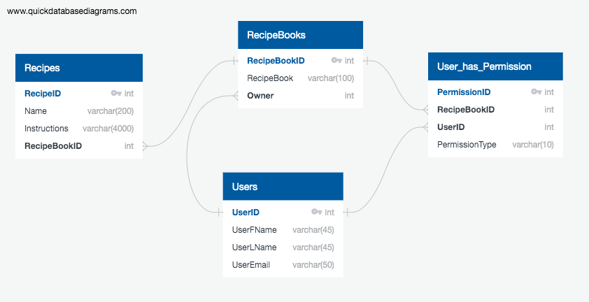

# Family Traditions

Family Traditions is a React Native application designed to help families preserve and share their culinary heritage. This app allows users to create and share digital books of family recipes, ensuring that these cherished traditions are passed down through generations.

## Features

- **User Authentication**: Secure login and sign-up screens for user authentication.
- **Password Reset**: Users can reset their passwords via email.
- **Create Account**: New users can create an account to access the app.
- **Home Screen**: A welcoming screen that serves as the landing page after login.
- **Recipe Book Screen**: Displays a collection of digital recipe books.
- **Book Screen**: Users can view their family recipe books.
- **Recipe Screen**: Displays individual recipes for users to follow or share.
- **Create Book Screen**: Allows users to create new digital recipe books.
- **Family Members Screen**: Users can view and add family members to their books.
- **Create Recipe Screen**: Users can add new recipes to their books.

## Technical Overview

- **Expo - React Native**: The app is built using Expo, a framework for building cross-platform applications.
- **Postgres/Neon**: The database is built using Postgres and Neon, a PostgreSQL client for Node.js.
- **Clerk**: User authentication is handled by Clerk, a secure authentication service.
- **Cloudinary**: Images are stored using Cloudinary, a cloud-based image management service.

## Database Schema

Below is the database schema diagram for our project:

## Installation and Setup

To run the app locally:

1. Clone the repository.
2. Install dependencies using `npm install`.
3. Start the app using `npx expo start`.

## Contributing

Contributions to the Family Traditions app are welcome. Please read the [contribution guidelines](CONTRIBUTING.md) before submitting a pull request.

## License

This project is licensed under the MIT License - see the [LICENSE.md](LICENSE.md) file for details.
